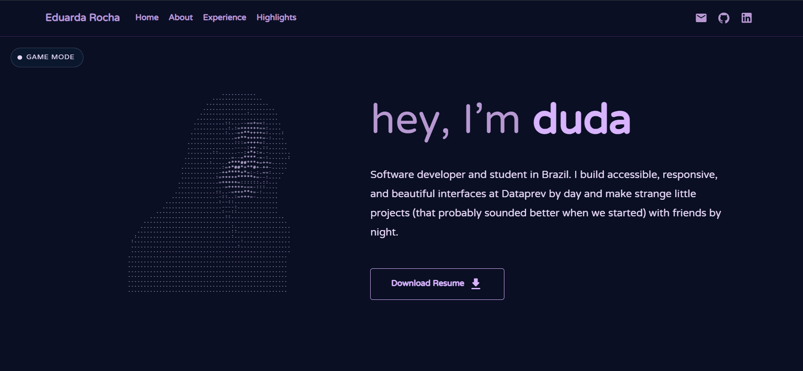

<p align="center">
  My personal portfolio website, showcasing my projects, skills, experience, and journey as a Front-end Developer.
</p>

<p align="center">
  <a href="https://meduarda-dev.github.io/Portifolio/" target="_blank">
    <strong>🚀 Visit the live portfolio</strong>
  </a>
</p>

<p align="center">
  Built with React, TypeScript, and modern UI technologies.
</p>

<p align="center">
  
</p>

## ✨ Features

* Responsive design
* Modern and accessible UI
* Projects showcase
* About me section
* Skills and technologies
* Professional experience
* Contact section
* Smooth navigation and interactions

## 🛠 Tech Stack

<p align="left">
  
  
  
  
  
</p>

## 🚀 Getting Started

### Prerequisites

Make sure you have Node.js and npm installed on your machine.

### Installation

1. Clone the repository:

   ```sh
   git clone https://github.com/meduarda-dev/Portifolio.git
   ```

2. Navigate to the project directory:

   ```sh
   cd Portifolio
   ```

3. Install the dependencies:

   ```sh
   npm install
   ```

4. Start the development server:

   ```sh
   npm run dev
   ```

The application will be available at the local URL provided by Vite.

## 📦 Build for Production

Generate the production build with:

```sh
npm run build
```

To preview the production build locally:

```sh
npm run preview
```

## 📁 Project Structure

```text
src/
├── assets/       # Images and static assets
├── components/   # Reusable UI components
├── pages/        # Portfolio sections/pages
├── App.tsx
└── main.tsx
```

## 👩‍💻 About

This portfolio was created to showcase my work, technical skills, and experience as I transition into Front-end Development.

I'm particularly interested in building intuitive, responsive, and accessible interfaces using modern web technologies.

## 📫 Contact

<p align="left">
  <a href="https://www.linkedin.com/in/eduardarocha22/" target="_blank">LinkedIn</a> ·
  <a href="https://github.com/meduarda-dev" target="_blank">GitHub</a> ·
  <a href="mailto:meduardarocha97@gmail.com">Email</a>
</p>

---

<p align="center">
  Made with 💜 by Duda
</p>
