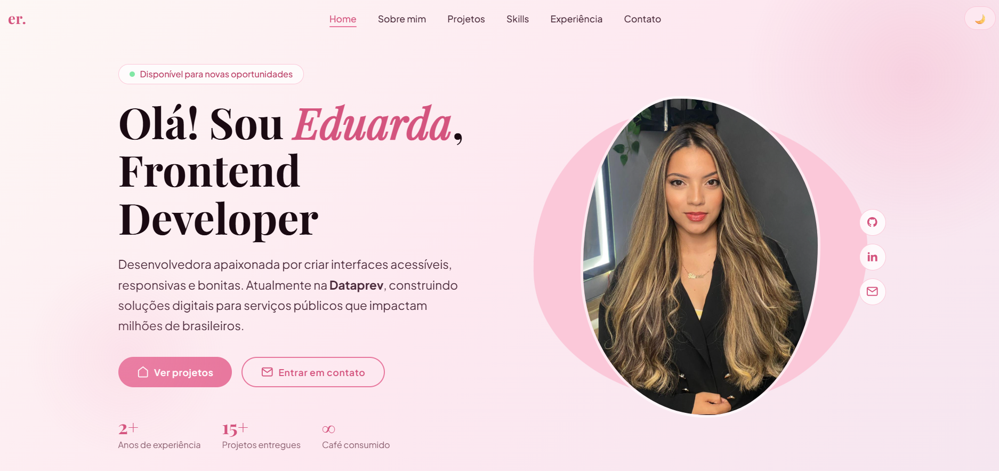

<h1 align="center">
  
</h1>

<h2 align="center">✨ Portfólio — Eduarda Rocha</h2>

<p align="center">
  <strong>Frontend Developer · Dataprev · Ciência da Computação</strong>
</p>

<p align="center">
  <a href="https://meduarda-dev.github.io/Portifolio/">
    
  </a>
  <a href="https://linkedin.com/in/eduardarocha22">
    
  </a>
  <a href="https://github.com/meduarda-dev">
    
  </a>
  
</p>

---

## ❤️ Sobre o projeto

Portfólio pessoal desenvolvido para apresentar minha trajetória, projetos e habilidades como desenvolvedora Frontend. O site é continuamente atualizado — porque crescimento não tem data de entrega.

> Foco em interfaces **acessíveis**, **responsivas** e com **boa experiência para o usuário**.

---

## 🗂️ Seções

| Seção | Descrição |
|---|---|
| **Home** | Apresentação pessoal e links de contato |
| **Sobre mim** | Trajetória profissional e acadêmica |
| **Projetos** | Seleção de projetos desenvolvidos |
| **Conhecimentos** | Stack e tecnologias que utilizo |
| **Contato** | Formas de me encontrar |

---

## 🛠️ Tecnologias

<div>
  
  
  
  
</div>

---

## 📐 Conceitos aplicados

- **Semântica HTML** — estrutura clara e significativa
- **Acessibilidade** — boas práticas de a11y e ARIA
- **Mobile first** — responsividade em todos os dispositivos
- **Dark/Light mode** — alternância de tema via CSS e JavaScript
- **Animações** — ScrollReveal para entrada suave dos elementos
- **CSS Custom Properties** — sistema de design baseado em variáveis

---

## 🚀 Como rodar localmente

```bash
# Clone o repositório
git clone https://github.com/meduarda-dev/Portifolio.git

# Entre na pasta
cd Portifolio

# Abra o index.html no navegador
# (ou use a extensão Live Server no VS Code)
```

---

## 📬 Contato

<p>
  <a href="mailto:meduardarocha97@gmail.com">
    
  </a>
  <a href="https://linkedin.com/in/eduardarocha22">
    
  </a>
  <a href="https://github.com/meduarda-dev">
    
  </a>
</p>

---

## 📄 Licença

Distribuído sob a [MIT License](./LICENSE).

---

<p align="center">
  Feito com 💕 por <a href="https://github.com/meduarda-dev"><strong>Eduarda Rocha</strong></a>
</p>
